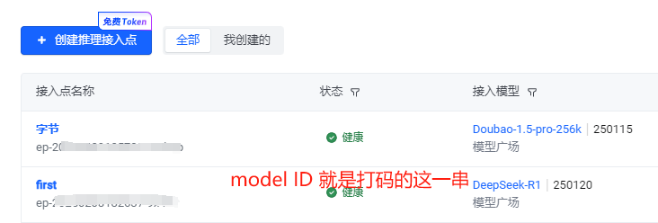
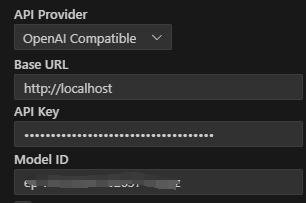

# OpenAI-Doubao

奈何深度求索和硅基流动的 deepseek R1 都太卡了，所以到处找可以替代的。昨天发现豆包也有部署 deepseek 的模型，于是就想在 cline 中使用。

豆包的文档明确写着是兼容 OpenAI API 接口，但是实际使用报错，已经提交了工单给豆包，希望尽快解决。

[豆包接口文档](https://console.volcengine.com/ark/region:ark+cn-beijing/endpoint/detail)

在官方没解决之前，我又等不及了，于是查了下是什么问题导致的。

找到问题后，于是写下了这个项目。

## 项目介绍

项目本身就是个代理，在代理前，对请求进行处理，然后再转发给豆包。

这个项目的核心，就是将`MultiContent`转成普通的`Content`去请求，当然，这会丢弃图片功能，cline 本身也不具备图片功能，所以无所谓。

代码很简单，一眼就看得懂

**本项目不限于使用豆包中的deepseek模型，也可以使用豆包自己的模型，只要支持openAI API即可**

## 如何使用

在线运行：

```
go run main.go
```

也可先构建后运行：

```
go build main.go
./main
```

以上使用的是默认端口80，可以修改源码，也可以带端口运行：

```
go run main.go 8080
```
或
```
go build main.go
./main 8080
```

实测下来没啥问题，可以正常使用。

## 鸣谢
CLINE-Doubao-Server：解锁多模态AI新体验 。https://github.com/shikanon/cline-doubao-server 。受这个项目的启发，才知道有这么一回事。

## cline 配置
modelId:https://console.volcengine.com/ark/region:ark+cn-beijing/endpoint


apiKey:https://console.volcengine.com/ark/region:ark+cn-beijing/apiKey




## 免责声明
未经大量测试，并不能保证效果和原始方式一致！

本项目仅用于学习研究，不对其余问题负责。
